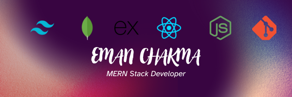

  

###

  
  
  
  
  

  
  

###

###

<h1 align="center">Hey there 👋</h1>

###

<h3 align="left">👩‍💻  About Me</h3>

###

I'm Eman Chakma from Khagrachari, Chattogram Hill Tracts, Bangladesh.  - 🔭 I’m working as a junior MERN Stack Developer. - 📚 I'm currently learning advanced web development techniques. - ⚡ In my free time, I enjoy coding, reading tech blogs, and exploring new technologies.

###

<h3 align="left">🛠 Language and Tools</h3>

###

<!-- Add HTML5, CSS, and Sass logos -->
  
  
  
  
  
   
  
  
  
  
  
  
  
  
  
  
  
  
  
 
  

###

# 🔥 GitHub Stats:

 
 

---

